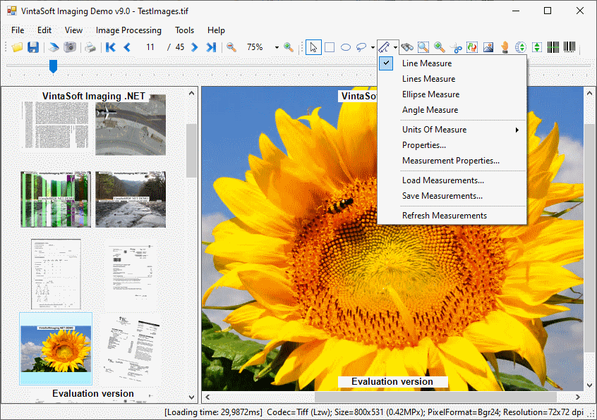

<h1>VintaSoft WinForms Imaging Demo</h1>

Demo application shows how to load, view, process, print and save images and documents. Several image files can be loaded into one image collection. Thumbnail viewer shows thumbnails of images from the image collection, image viewer shows single image from the image collection. Single image from the image collection can be scrolled, zoomed, viewed with magnifier, processed, printed, saved to clipboard or file, deleted from the image collection. Resulted image collection can be saved as multipage TIFF, GIF, JBIG2 file or PDF document, and more. Source codes for C# and VB.NET are available. 
 
Demo uses functionality of <a href="https://www.vintasoft.com/vsimaging-dotnet-index.html">VintaSoft Imaging .NET SDK</a>.

<h2>Screenshot</h2>

<h2>Download</h2>
VintaSoft Imaging .NET SDK distributive package can be downloaded here: https://www.vintasoft.com/download.html

<h2>Documentation</h2>
VintaSoft Imaging .NET SDK on-line User Guide and API Reference is available here: https://www.vintasoft.com/docs/vsimaging-dotnet/

<h2>Support</h2>
Please visit our <a href="https://www.vintasoft.com/support/">online support center</a> if you have any question or problem.
